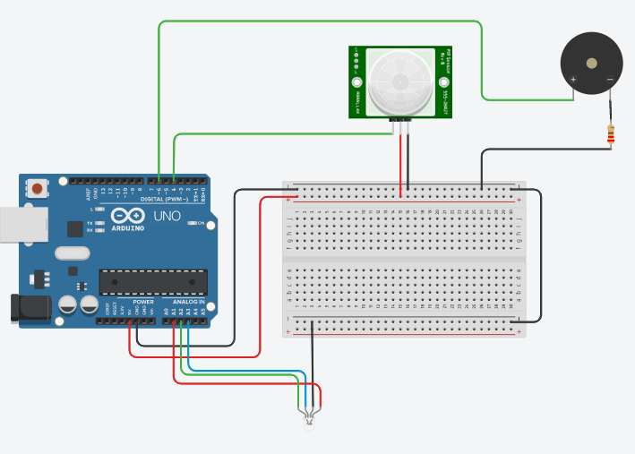

# IoT_edge_computing_iniciantes_pratica_microbit_Arduino
Curso de IoT e edge computing para iniciantes na prática com microbit e Arduino 

Projeto para conclusão do curso de extensão
\nProjeto Led RGB com sensor de presença e piezo

